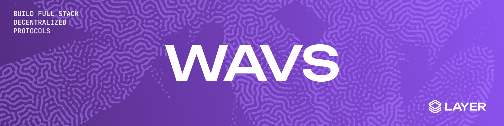
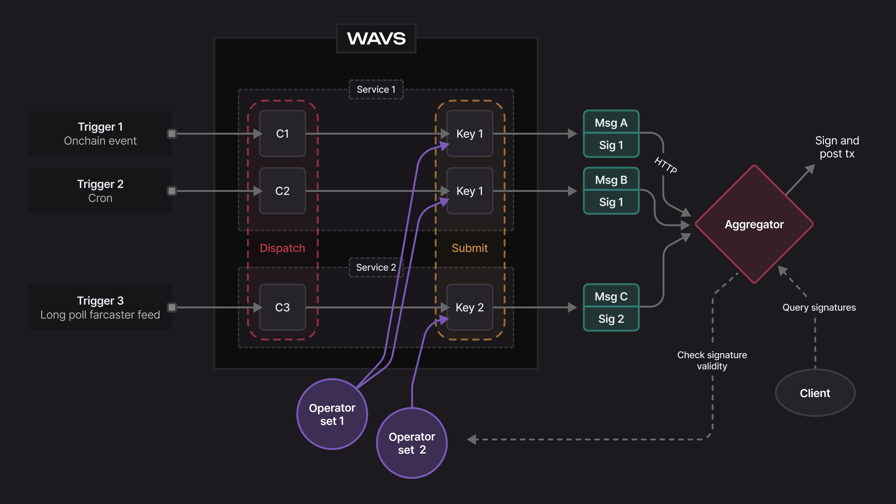

# WAVS

test2

WAVS is a next-generation AVS (Actively Validated Service) platform, making it easy to create, manage, and operate high-performance AVSs. By providing a base layer of AVS infrastructure, WAVS allows builders to focus solely on implementing the core logic of their services, which are written in Rust (with support for more languages coming soon), compiled to WASM, and deployed as lightweight service components. Triggered by onchain events, these components are run offchain by operators in the WAVS WASI runtime at near-native speed, and the results are brought verifiably onchain. A service of services, WAVS allows an AVS to dynamically run and manage multiple components that work together to build flexible and intelligent applications.

## Multichain-ready

WAVS is designed for the multichain, enabling services to be triggered and results to be posted across different chains. Initially supported on EVM and Cosmos, WAVS creates a cross-chain computational layer that is decentralized and verifiable.

## Guides

- [Quickstart](docs/QUICKSTART.md)
- [Docker Quickstart](docs/QUICKSTART.md#running-with-docker)
- [Docs](docs/README.md)

## Overview

WAVS is node software for operators that runs an AVS [WASI](https://wasi.dev/) runtime which is easily configurable and can serve multiple AVSs. The logic for each AVS is deployed as a WASI service component. These service components are sandboxed from each other and from the node's operating system. This way, operators and AVS services maintain a clean separation, with AVS builders uploading components and operators having to opt-in to each service.

Onchain events can trigger a service's WASI components, which are run offchain by operators in the AVS WASI runtime. Results are then verified and brought back onchain, enabling the decentralized execution of offchain services which are verifiable onchain.

1. A service is defined, including a WASI component and triggers.
2. Service operators listen for onchain events.
3. An onchain event triggers a task, and operators run the WASI component offchain.
4. Operators sign the result of the task.
5. (Optional for EVM) The signatures are sent to the aggregator contract which consolidates the results into one transaction.
6. The result is submitted onchain.

