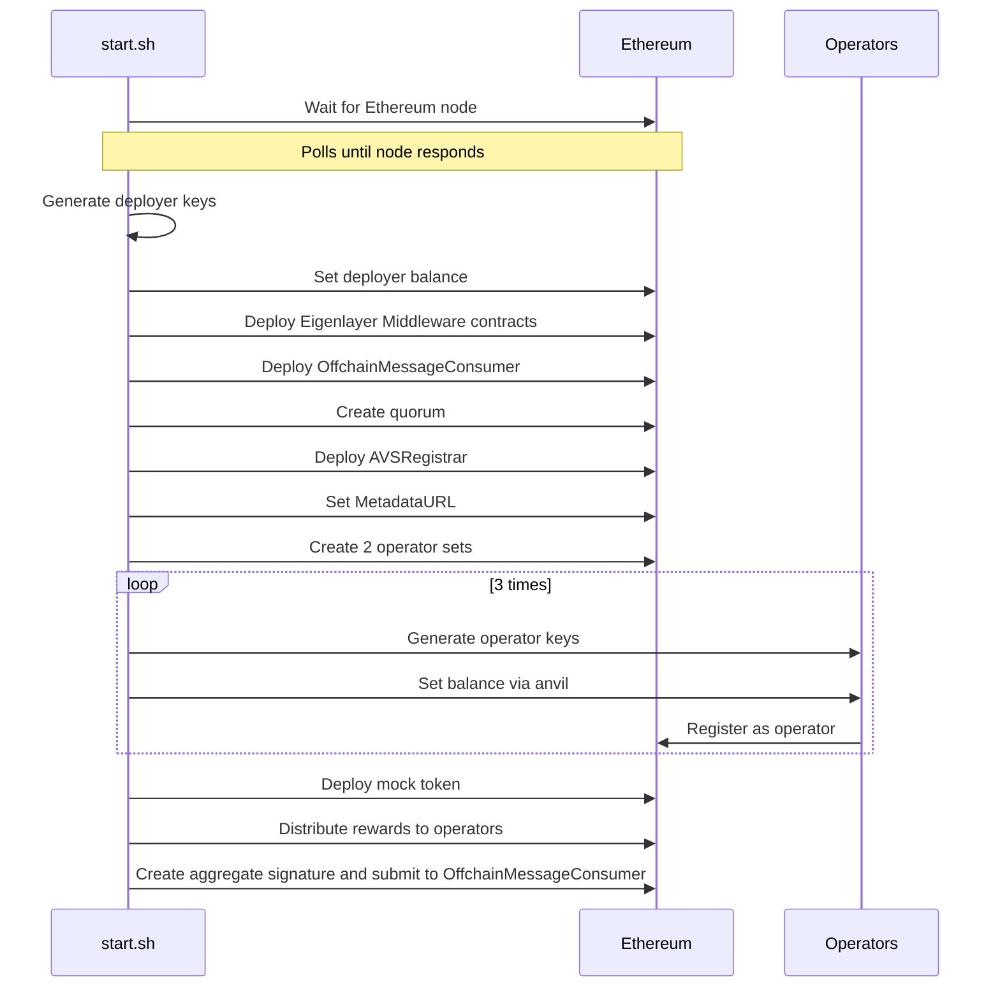

# EigenLayer Hello World AVS Setup

This repository contains a Docker-based setup for running an EigenLayer Hello World AVS (Actively Validated Service) node.

## Prerequisites

- Docker and Docker Compose
- Rust (for local development)
- Node.js and Yarn (will be installed in container)
- Foundry (will be installed in container)

## Project Structure

```
.
├── docker/
│   ├── eigenlayer/         # EigenLayer setup container configuration
│   │   ├── Dockerfile      # Eigenlayer middleware deployment, Layer SDK deployment
│   │   └── start.sh        # Deployment script
│   └── ethereum/           # Mock Ethereum node setup
├── .nodes/                 # Operator node data (mounted volume)
├── docker-compose.yml      # Docker services configuration
└── .env                    # Environment configuration
```

## Quick Start

1. Clone the repository:
   ```bash
   git clone --recurse-submodules <repository-url>
   ```

2. Copy the example environment file:
   ```bash
   cp example.env .env
   ```
(Add a private key to `PRIVATE_KEY` with a hex prefix, fill in `ETHERSCAN_API_KEY`)

3. Build and start the services:
   ```bash
   docker-compose build
   docker-compose up
   ```

## Architecture

The project consists of two main services:

```bash
docker compose up --build
```

This will:
1. Start an Ethereum node (Anvil) on port 8545
2. Deploy the Hello World contracts
3. Set up 3 operators with appropriate balances and permissions

## Architecture

The setup consists of two main services:

1. **Ethereum Node** (ethereum):
   - Runs Anvil for local development
   - Forks from a specified RPC URL
   - Exposes port 8545

2. **EigenLayer Setup** (eigenlayer):
   - Builds from Rust base image
   - Installs Foundry toolchain
   - Clones and builds the Hello World AVS
   - Sets up operators and deploys contracts
   - Deploys a Layer consumer example utilizing the Layer SDK 
   - Submits a task to the Layer Consumer 


## Cleanup

To clean up all containers and volumes:
```bash
docker compose down -v --remove-orphans --rmi all
```

## Development

For local development, the services use volume mounting to persist operator data in the `.nodes` directory.

## References

- [EigenLayer Documentation](https://docs.eigenlayer.xyz/)
- [Hello World AVS Repository](https://github.com/Layr-Labs/eigenlayer-hello-world)

## Configuration Parameters

### Environment Variables
- `PRIVATE_KEY`: Your private key with hex prefix (e.g., 0x123...)
- `RPC_URL`: RPC endpoint for the network (default: https://holesky.drpc.org)
- `CHAIN_ID`: Network chain ID (default: 17000 for Holesky)
- `ETHERSCAN_API_KEY`: Your Etherscan API key for contract verification
- `QUICK_MODE`: ON or OFF. Runs just whats neccesary for signature verification

### Testnet Parameters
- `TESTNET_RPC_URL`: RPC endpoint for testnet (default: https://holesky.drpc.org)
- `DEPLOY_ENV`: Deployment environment setting
  - Set to `TESTNET` for testnet deployment
  - Set to `LOCAL` for local development
- `FUNDED_KEY`: Private key with funds on testnet
  - Required when `DEPLOY_ENV=TESTNET`
  - Used to fund operator accounts
- `LST_CONTRACT_ADDRESS`: Liquid Staking Token contract address
  - On Holesky: 0x3F1c547b21f65e10480dE3ad8E19fAAC46C95034 (sETH)
  - Required for operator staking
- `LST_STRATEGY_ADDRESS`: Strategy contract address for the LST
  - On Holesky: 0x7D704507b76571a51d9caE8AdDAbBFd0ba0e63d3 (sETH strategy)
  - Required for operator deposits

The setup will:
1. Fund each operator with ETH from the `FUNDED_KEY`
2. Mint LST tokens for the operator
3. Approve LST spending for the strategy
4. Deposit LST into the strategy
5. Register the operator with EigenLayer

