# Deployment

## Overview
The deployment script (`docker/eigenlayer/start.sh`) handles the setup and initialization of the WAVS Middleware system, including simulation of operator registration, and rewards distribution.

## Environment Variables
- `DEPLOY_ENV`: The deployment environment (`LOCAL` or `TESTNET`)
- `TESTNET_RPC_URL`: Required RPC URL when deploying to testnet
- `LST_CONTRACT_ADDRESS`: LST contract address
- `LST_STRATEGY_ADDRESS`: LST strategy address
- `FUNDED_KEY`: The account that will fund all deployment transactions (required for `TESTNET`)

## Step

### 1. Initial Setup
- Creates and funds the deployer account
- Contract deployments (LayerMiddleware, OffchainMessageConsumer)

### 2. Middleware Setup
- Creates a Quorum
- Deploys and configures AVSRegistrar
- Creates 2 operator sets

### 3. Operator Setup
- Creates and funds multiple operator accounts
- Mints LST tokens for operators
- Registers operators with EigenLayer
- Registers operators for WAVS services

### 4. Rewards Distribution 
- Deploys mock ERC20 token for testing
- Distributes rewards to operators via EigenLayer

### 5. Offchain Message Consumer
- Aggregates signatures from operators
- Submits aggregated signature to OffchainMessageConsumer

## Usage

### Local Development
Go to `README.md` and follow the instructions to run the deployment script.

## Class Diagram

```mermaid
classDiagram
    class ECDSAStakeRegistry {
        +IDelegationManager delegationManager
        +initialize(address _serviceManager, uint32 _minimumStake, Quorum memory quorum)
        +updateQuorumConfig(IECDSAStakeRegistryTypes.Quorum memory quorum, address[] memory operators);
    }

    class OffchainMessageConsumer {
        +validateOffchainMessage(bytes32 dataHash, bytes signatureData) returns (bool)
    }

    class WAVSAVSRegistrar {
        +registerOperator(address operator)
        +deregisterOperator(address operator, uint32[] calldata operatorSetIds)
    }

    class WAVSServiceManager {
        +initialize(address _initialOwner, address _initialPauser)
        +createOperatorSets(IAllocationManager.CreateSetParams[] memory params)
        +createOperatorDirectedAVSRewardsSubmission(IRewardsCoordinator.OperatorDirectedRewardsSubmission[] operatorDirectedRewardsSubmissions)

        +avsDirectory: address
        +stakeRegistry: address
        +rewardsCoordinator: address
        +delegationManager: address
        +allocationManager: address
    }

    class MockToken {
        +string name
        +string symbol
        +transferFrom(address from, address to, uint256 amount)
    }

    namespace EigenLayer {
        class AllocationManager {
            +allocateRewards(address[] memory operators, uint256[] memory amounts)
        }

        class RewardsCoordinator {
            +createOperatorDirectedAVSRewardsSubmission(IRewardsCoordinator.OperatorDirectedRewardsSubmission[] operatorDirectedRewardsSubmissions)
        }

        class StrategyManager {
            +depositIntoStrategy(IStrategy strategy, IERC20 token, uint256 amount) returns (uint256 depositedShares)
        }

        class DelegationManager {
            +registerAsOperator(address operator, uint32 operatorSetId, string operatorName)
        }
    }

    WAVSServiceManager ..> AllocationManager : depends on
    WAVSServiceManager ..> RewardsCoordinator : depends on
    WAVSServiceManager ..> MockToken : depends on
    WAVSServiceManager *-- WAVSAVSRegistrar : owns
    OffchainMessageConsumer o-- ECDSAStakeRegistry : depends on

```

