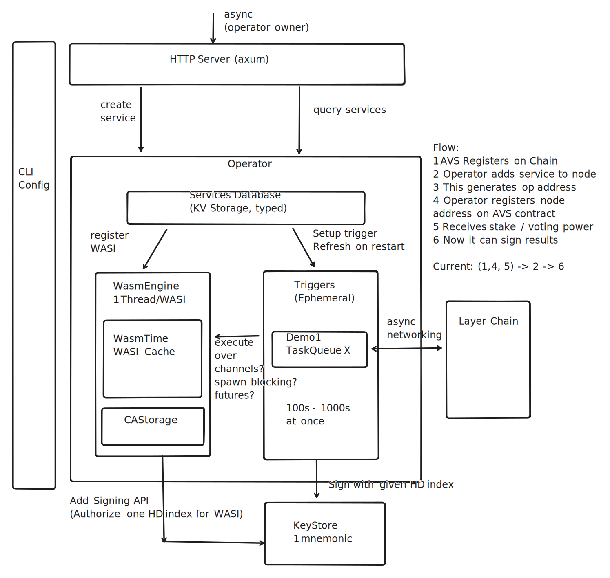

# Wavs architecture

WAVS is an AVS operator node which is quickly configurable to easily serve
logic for many AVSs, each one sandboxed from each other, and from the node's
operating system.

To achieve this sandboxing, [WASI](https://wasi.dev/interfaces) components are used, with limited access to system resources.

## Persona

This node should be run by an "Operator", which is a node participant that is very similar to "validator" on a PoS chain.
Operators receive commitments (stake) on the chain, which provide it with voting power, and it performs
some off-chain actions, which are submitted on-chain and verified.

Currently, for demo purposes, we expose the HTTP API to make adding new WASI components easy.
However, in any realistic scenario, each node is managed by an operator, which must explicitly
opt-in to running the AVS software, and then register their intention on-chain, in order
to collect commitments.

The AVS team, which will code all the WASI components, and deploy (and write?) the AVS contracts
on-chain should be completely independent of the operators for a clean separation of concerns,
and thus have no access to their system.

## Architecture

Start by looking at this overview diagram of the various components of the system

