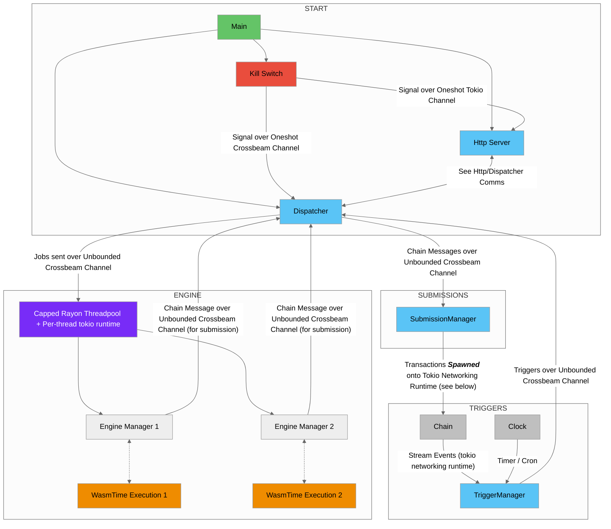

## Overall Message and Channels Flow

## Channel kinds

1. Crossbeam channels for sending to sync contexts (every non-http subsystem, in its own thread)
2. Tokio channels for sending to async contexts (http-server)

## Backpressure

Hard constraint for subsystems to be able to send out their messages and keep working. In other words - always unbounded channels, never waiting for the reciever to do their work.

Practically speaking, backpressure is isolated to one place: Engine deciding not to spawn more threads yet - and that means its receiving channel will grow in memory as more jobs are built up (as expected, and can be dealt with, e.g. to discard jobs. Point is it's within the EngineManager to decide that, without blocking other subsystems).

In more detail:
- TriggerManager queries the chain and gets a trigger, sends it to Dispatcher
- Dispatcher gets the Trigger, _immediately_ sends it to Engine
    - From TriggerManager perspective, backpressure is relieved, channel is clear
- Engine gets a job, may or may not spawn a thread to handle it (capped by threadpool)
    - This is where the pressure builds (the _only_ place it builds in terms of channels)
- Engine finishes job and sends result to Dispatcher
- Dispatcher gets a ChainMessage, _immediately_ sends it to SubmissionManager
    - From Engine perspective, backpressure is relieved, channel is clear
- SubmissionManager gets the ChainMessage, _immediately_ spawns a tokio task to write to chain
    - From Dispatcher perspective, backpressure is relieved, channel is clear

## Async runtimes

1. Top-level networking shares a single Tokio runtime, perhaps multi-threaded. This includes HttpServer, SubmissionManager (for sending transactions), and TriggerManager (for querying the chain)

2. WASI Components each get their own async runtime per-thread, since we can't know what the user might do - we don't want it to block the top-level networking runtime

## Http Dispatcher Comms

Allows multiple request/responses in flight

1. Http creates a oneshot tokio channel
2. Http sends the oneshot-sender over an unbounded crossbeam channel
3. Http awaits the oneshot-receiver
4. Dispatcher gets the oneshot-sender from the channel
5. Dispatcher sends over the oneshot-sender (Http then continues past its await)

## Submissions

1. Transactions get spawned onto the tokio runtime, do not block other submissions
2. TBD - how to handle hd-index or wrong-sequence-like issues
    - one idea: tokio mutex per hd-index (or wallet), the inner future takes the lock and awaits it, thereby asynchronously blocking other submissions that need to use the same exact wallet, but _not_ blocking unrelated submissions (i.e. it just stops at the await point until it can progress, but this does _not_ stop other tasks from being spawned or taking messages off the channel).

## Kill Switch

* Http server awaits its oneshot tokio channel and gracefully shuts down
* Dispatcher selects on the oneshot crossbeam channel and other crossbeam channel(s) - i.e. TriggerManager
* Gracefully drops everything closer to the start
