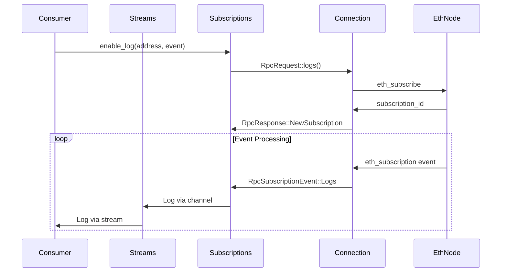

# EVM Trigger Client Explainer

This module implements a WebSocket-based Ethereum client that provides real-time streams of blockchain data (block heights, logs, pending transactions). It's designed to be resilient with automatic failover between multiple endpoints and optimized for efficient API usage with third-party providers.

## ⚠️ Important Design Constraints

### Single Chain Per Client
**All WebSocket endpoints must be for the same blockchain.** This client is designed for high availability within a single chain, not multi-chain support.

- ✅ **Correct**: Multiple endpoints for Ethereum mainnet
- ✅ **Correct**: Multiple endpoints for Polygon
- ❌ **Wrong**: Mixing Ethereum mainnet and Polygon endpoints in one client

**For multi-chain support, create separate client instances:**
```rust
// Correct approach for multi-chain
let ethereum_streams = EvmTriggerStreams::new(vec![
    "wss://eth-mainnet-1.example.com",
    "wss://eth-mainnet-2.example.com",
]);

let polygon_streams = EvmTriggerStreams::new(vec![
    "wss://polygon-1.example.com",
    "wss://polygon-2.example.com",
]);

// Multiple clients can be multiplexed to get unified cross-chain data
use futures::stream::{self, StreamExt};
let unified_logs = stream::select(
    ethereum_streams.log_stream.map(|log| ("ethereum", log)),
    polygon_streams.log_stream.map(|log| ("polygon", log)),
);

while let Some((chain, log)) = unified_logs.next().await {
    println!("Log from {}: {:?}", chain, log);
}
```

### Read-Only Operations
**This client is exclusively for inbound data streams.** It does not support transaction broadcasting or state modification.

- ✅ **Supported**: Block monitoring, event logs, pending transaction hashes
- ❌ **Not supported**: Sending transactions, calling state-changing methods, wallet operations

For transaction broadcasting, use a separate client (e.g., alloy Provider with HTTP endpoints).

### API Rate Limit Optimization
**This client is designed to minimize network traffic and respect third-party API rate limits.** It intelligently manages subscriptions to avoid unnecessary requests:

- **Smart Log Filtering**: Automatically consolidates multiple log subscriptions into fewer, more efficient filter requests
- **Dynamic Subscription Management**: Replaces existing subscriptions on-the-fly when filter parameters change, rather than creating additional subscriptions
- **Minimal Connection Overhead**: Reuses existing subscriptions where possible and only creates new ones when necessary

This makes it well-suited for use with rate-limited providers like Infura, Alchemy, or QuickNode.

## High-Level Architecture

The EVM client is built around three main components working together:

1. **Connection Management** - Handles WebSocket connections with intelligent retry logic
2. **Subscription Management** - Manages Ethereum subscriptions and processes incoming data
3. **Channel-based Communication** - Wires the Connection and Subscription components together using type-safe channels, and exposes user-facing streams

## Data Flow

### 1. Initialization
```rust
let streams = EvmTriggerStreams::new(vec![
    "ws://node1:8546".to_string(),
    "ws://node2:8546".to_string(),
]);
```

- Creates internal channels for communication
- Spawns connection and subscription management tasks
- Returns streams that consumers can iterate over

### 2. Subscription Management
```rust
// Enable block height notifications
streams.controller.subscriptions.toggle_block_height(true);

// Subscribe to specific contract logs
streams.controller.subscriptions.enable_log(
    Some(contract_address),
    Some(event_signature)
);
```

- Sends `eth_subscribe` requests to the connected node
- Tracks subscription IDs and manages their lifecycle
- Handles resubscription when connections change

### 3. Data Processing Pipeline



## Key Components

### Connection (`connection.rs`)
- **Purpose**: Manages WebSocket connections with intelligent failover
- **Retry Strategy**:
  - Cycles through all endpoints at current backoff level
  - Doubles backoff after complete failure cycle (1s → 2s → 4s → ... → 30s max)
  - Resets on successful connection
- **Handles**: Connection establishment, message routing, graceful disconnection

### Subscriptions (`subscription.rs`)
- **Purpose**: Manages Ethereum subscriptions and data processing
- **Key Features**:
  - Tracks active subscriptions by type and parameters
  - Handles subscription/unsubscription lifecycle
  - Parses incoming events and routes to appropriate channels
  - Manages resubscription on reconnection
- **Thread Safety**: Uses Arc/Mutex for safe concurrent access

### RPC Types (`rpc_types/`)
- **Inbound** (`inbound.rs`): Deserializes JSON-RPC responses and subscription events
- **Outbound** (`outbound.rs`): Serializes subscription requests to JSON-RPC
- **ID Management**: Tracks request IDs and associates them with subscription types

### Channels (`channels.rs`)
- **Purpose**: Provides type-safe communication between components
- **Structure**: Separates concerns with dedicated channel sets for each component
- **Flow**: Connection ↔ Subscription ↔ Client streams

## Usage Patterns

### Basic Block Monitoring
```rust
let mut streams = EvmTriggerStreams::new(endpoints);
streams.controller.subscriptions.toggle_block_height(true);

while let Some(height) = streams.block_height_stream.next().await {
    println!("New block: {}", height);
}
```

### Contract Event Monitoring
```rust
let mut streams = EvmTriggerStreams::new(endpoints);
streams.controller.subscriptions.enable_log(
    Some(contract_address),
    Some(Transfer::SIGNATURE_HASH),
);

while let Some(log) = streams.log_stream.next().await {
    let transfer = Transfer::decode_log(&log.inner).unwrap();
    println!("Transfer: {} → {} ({})", transfer.from, transfer.to, transfer.value);
}
```

### Multiple Subscription Management
```rust
// Add multiple contracts/events at once
streams.controller.subscriptions.enable_logs(
    vec![contract1, contract2],
    vec![Transfer::SIGNATURE_HASH, Approval::SIGNATURE_HASH],
);

// Remove specific subscriptions
streams.controller.subscriptions.disable_log(
    Some(contract1),
    Some(Transfer::SIGNATURE_HASH),
);
```

## Resilience

### Connection Failures
- As mentioned above, utomatically cycles through provided endpoints
- Implements exponential backoff with jitter
- Maintains subscription state across reconnections

### Subscription Management
- Tracks in-flight RPC requests to avoid duplicates
- Handles late-arriving subscription confirmations
- Gracefully unsubscribes when parameters change

### Data Processing
- Robust JSON parsing with fallback error handling
- Type-safe event deserialization
- Separate error paths for connection vs. data issues

## Testing Strategy

The module includes comprehensive tests covering:

- **Basic functionality**: Single event type streaming
- **Multi-subscription**: Multiple events from single/multiple contracts
- **Failover scenarios**: Node failures and endpoint cycling
- **Subscription lifecycle**: Adding/removing subscriptions dynamically
- **Edge cases**: Late subscription confirmations, network partitions

## Performance Considerations

- **Async Design**: Non-blocking operations throughout
- **Channel-based**: Efficient message passing between components
- **Resource Management**: Proper cleanup of tasks and connections
- **Backpressure**: Unbounded channels (WAVS pushes backpressure to the execution engine, by design)
