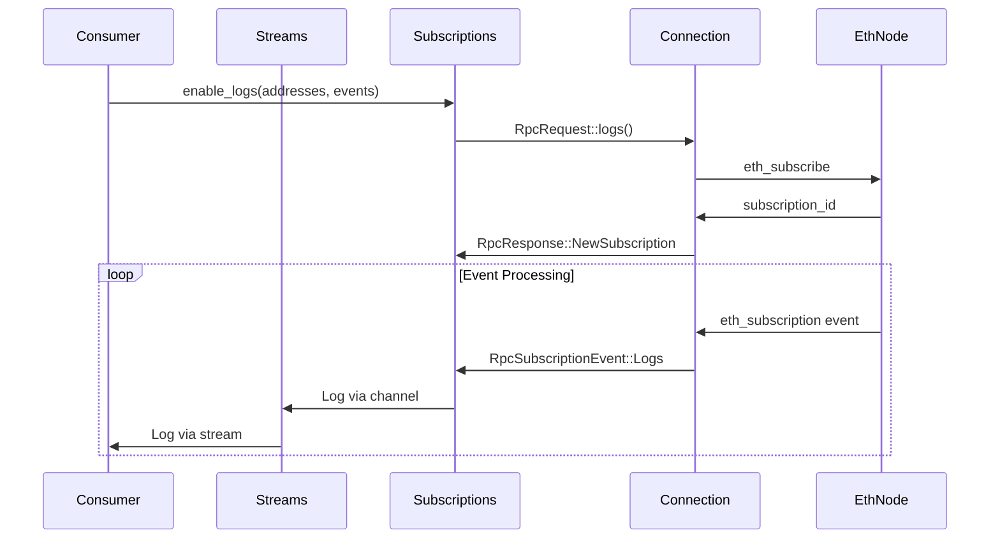

# EVM Trigger Client Explainer

This module implements a WebSocket-based Ethereum client that provides real-time streams of blockchain data (block heights, logs, pending transactions). It's designed to be resilient with automatic failover between multiple endpoints and optimized for efficient API usage with third-party providers.

## ⚠️ Important Design Constraints

### Single Chain Per Client
**All WebSocket endpoints must be for the same blockchain.** This client is designed for high availability within a single chain, not multi-chain support.

- ✅ **Correct**: Multiple endpoints for Ethereum mainnet
- ✅ **Correct**: Multiple endpoints for Polygon
- ❌ **Wrong**: Mixing Ethereum mainnet and Polygon endpoints in one client

**For multi-chain support, create separate client instances:**
```rust
// Correct approach for multi-chain
let ethereum_streams = EvmTriggerStreams::new(vec![
    "wss://eth-mainnet-1.example.com",
    "wss://eth-mainnet-2.example.com",
]);

let polygon_streams = EvmTriggerStreams::new(vec![
    "wss://polygon-1.example.com",
    "wss://polygon-2.example.com",
]);

// Multiple clients can be multiplexed to get unified cross-chain data
use futures::stream::{self, StreamExt};
let unified_logs = stream::select(
    ethereum_streams.log_stream.map(|log| ("ethereum", log)),
    polygon_streams.log_stream.map(|log| ("polygon", log)),
);

while let Some((chain, log)) = unified_logs.next().await {
    println!("Log from {}: {:?}", chain, log);
}
```

### Read-Only Operations
**This client is exclusively for inbound data streams.** It does not support transaction broadcasting or state modification.

- ✅ **Supported**: Block monitoring, event logs, pending transaction hashes
- ❌ **Not supported**: Sending transactions, calling state-changing methods, wallet operations

For transaction broadcasting, use a separate client (e.g., alloy Provider with HTTP endpoints).

### Potential Duplicate Triggers

To ensure reliable delivery, some RPC providers may **replay recent events** when a WebSocket connection reconnects.  
This can cause **duplicate triggers** to be delivered even though the events were already processed.  
This behavior is normal for most Ethereum RPC providers.

**Common scenarios include:**
- Reconnecting after a brief network interruption  
- Switching to an RPC endpoint that is still catching up on blocks  
- Automatic subscription resubmission after a disconnection  

**For component developers:**  
Use `host::get_event_id()` to obtain a unique identifier for each trigger.  
If your component needs to handle deduplication, use the available storage buckets to track processed events.

### API Rate Limit Optimization
**This client is designed to minimize network traffic and respect third-party API rate limits.** It intelligently manages subscriptions to avoid unnecessary requests:

- **Smart Log Filtering**: Automatically consolidates multiple `enable_logs()` calls into a single, optimized subscription request. For example, calling `enable_logs([contract1], [event1])` followed by `enable_logs([contract2], [event1])` results in one subscription for `addresses: [contract1, contract2], topics: [event1]` rather than two separate subscriptions.

- **Dynamic Subscription Management**: When filters change via `enable_logs()` or `disable_logs()`, the system unsubscribes from the current log subscription and creates a new one with the updated filter parameters. This ensures only one active log subscription exists at any time, regardless of how many API calls were made to build up the filter.

- **Efficient Filter Representation**: Empty vectors in `enable_logs(vec![], vec![])` create unfiltered subscriptions that capture all logs, while non-empty vectors create precise filters using Ethereum's native OR semantics for both addresses and topics.

- **Minimal Connection Overhead**: Reuses existing subscriptions where possible and only creates new ones when filter parameters actually change.

This makes it well-suited for use with rate-limited providers like Infura, Alchemy, or QuickNode.

## High-Level Architecture

The EVM client is built around three main components working together:

1. **Connection Management** - Handles WebSocket connections with intelligent retry logic
2. **Subscription Management** - Manages Ethereum subscriptions and processes incoming data
3. **Channel-based Communication** - Wires the Connection and Subscription components together using type-safe channels, and exposes user-facing streams

## Data Flow

### 1. Initialization
```rust
let streams = EvmTriggerStreams::new(vec![
    "ws://node1:8546".to_string(),
    "ws://node2:8546".to_string(),
]);
```

- Creates internal channels for communication
- Spawns connection and subscription management tasks
- Returns streams that consumers can iterate over

### 2. Subscription Management
```rust
// Enable block height notifications
streams.controller.subscriptions.toggle_block_height(true);

// Subscribe to specific contract logs
streams.controller.subscriptions.enable_logs(
    vec![contract_address],
    vec![event_signature]
);
```

- Sends `eth_subscribe` requests to the connected node
- Tracks subscription IDs and manages their lifecycle
- Handles resubscription when connections change

### 3. Data Processing Pipeline



## Key Components

### Connection (`connection.rs`)
- **Purpose**: Manages WebSocket connections with intelligent failover
- **Retry Strategy**:
  - Cycles through all endpoints at current backoff level
  - Doubles backoff after complete failure cycle (1s → 2s → 4s → ... → 30s max)
  - Resets on successful connection
- **Handles**: Connection establishment, message routing, graceful disconnection

### Subscriptions (`subscription.rs`)
- **Purpose**: Manages Ethereum subscriptions and data processing
- **Key Features**:
  - Tracks active subscriptions by type and parameters
  - Handles subscription/unsubscription lifecycle
  - Parses incoming events and routes to appropriate channels
  - Manages resubscription on reconnection
- **Thread Safety**: Uses Arc/Mutex for safe concurrent access

### RPC Types (`rpc_types/`)
- **Inbound** (`inbound.rs`): Deserializes JSON-RPC responses and subscription events
- **Outbound** (`outbound.rs`): Serializes subscription requests to JSON-RPC
- **ID Management**: Tracks request IDs and associates them with subscription types

### Channels (`channels.rs`)
- **Purpose**: Provides type-safe communication between components
- **Structure**: Separates concerns with dedicated channel sets for each component
- **Flow**: Connection ↔ Subscription ↔ Client streams

## Log Filtering Technical Details

### Filter Consolidation Algorithm
The system maintains a single `LogFilter` struct containing:
- `addresses: HashSet<Address>` - Contract addresses to monitor
- `topics: HashSet<B256>` - Event signature hashes to monitor

**Consolidation Logic:**
1. **Additive Operations**: Each `enable_logs(addresses, topics)` call adds to the existing filter sets
2. **Single Subscription**: Only one `eth_subscribe("logs", filter)` is active at any time
3. **Replace-on-Change**: When filters change, the system unsubscribes from the current subscription and creates a new one
4. **Empty Set Semantics**: Empty `HashSet` means "match all" for that dimension

### Subscription Lifecycle

```rust
// Internal state progression:
// 1. Initial state: LogFilter { addresses: {}, topics: {} } -> No subscription
enable_logs(vec![addr1], vec![event1]);
// 2. LogFilter { addresses: {addr1}, topics: {event1} } -> Subscribe with filter

enable_logs(vec![addr2], vec![event2]);  
// 3. LogFilter { addresses: {addr1, addr2}, topics: {event1, event2} } 
//    -> Unsubscribe old, subscribe with new consolidated filter

disable_logs(&[addr1], &[event1]);
// 4. LogFilter { addresses: {addr2}, topics: {event2} }
//    -> Unsubscribe old, subscribe with reduced filter

disable_logs(&[addr2], &[event2]);
// 5. LogFilter { addresses: {}, topics: {} } -> Unsubscribe, no new subscription
```

**Key Behaviors:**
- **Atomic Updates**: Filter changes trigger immediate unsubscribe/resubscribe cycle
- **Deduplication**: Multiple calls with same parameters don't create duplicate subscriptions
- **State Persistence**: Filter state survives reconnection and is automatically reestablished
- **Thread Safety**: All operations are protected by `RwLock` for concurrent access

### Ethereum JSON-RPC Filter Mapping

The internal `HashSet` structures map to Ethereum's filter specification:

```rust
// Internal: LogFilter { addresses: {A, B}, topics: {T1, T2} }
// JSON-RPC: {
//   "address": ["0xA...", "0xB..."],        // OR semantics: A OR B  
//   "topics": [["0xT1...", "0xT2..."]]      // OR semantics: T1 OR T2
// }

// Internal: LogFilter { addresses: {}, topics: {T1} }  
// JSON-RPC: {
//   "topics": [["0xT1..."]]                 // No address filter = all addresses
// }

// Internal: LogFilter { addresses: {}, topics: {} }
// JSON-RPC: {}                             // No filters = all logs
```

**Topic Array Structure**: The system wraps topics in a nested array `[[T1, T2]]` to achieve OR semantics. In Ethereum's filter specification:
- `[T1, T2]` means `T1 AND T2` (both must match)  
- `[[T1, T2]]` means `T1 OR T2` (either can match)

## Usage Patterns

### Basic Block Monitoring
```rust
let mut streams = EvmTriggerStreams::new(endpoints);
streams.controller.subscriptions.toggle_block_height(true);

while let Some(height) = streams.block_height_stream.next().await {
    println!("New block: {}", height);
}
```

### Contract Event Monitoring
```rust
let mut streams = EvmTriggerStreams::new(endpoints);
streams.controller.subscriptions.enable_logs(
    vec![contract_address],
    vec![Transfer::SIGNATURE_HASH],
);

while let Some(log) = streams.log_stream.next().await {
    let transfer = Transfer::decode_log(&log.inner).unwrap();
    println!("Transfer: {} → {} ({})", transfer.from, transfer.to, transfer.value);
}
```

### Log Filtering and Subscription Management

The API supports flexible log filtering with both inclusive and exclusive operations:

```rust
// Subscribe to specific contracts and events
streams.controller.subscriptions.enable_logs(
    vec![contract1, contract2],
    vec![Transfer::SIGNATURE_HASH, Approval::SIGNATURE_HASH],
);

// Subscribe to all logs from specific contracts (any event)
streams.controller.subscriptions.enable_logs(
    vec![contract1, contract2],
    vec![], // empty events = all events
);

// Subscribe to specific events from any contract
streams.controller.subscriptions.enable_logs(
    vec![], // empty addresses = all addresses
    vec![Transfer::SIGNATURE_HASH, Approval::SIGNATURE_HASH],
);

// Subscribe to ALL logs (no filtering)
streams.controller.subscriptions.enable_logs(
    vec![], // all addresses
    vec![], // all events
);

// Remove specific log filters
streams.controller.subscriptions.disable_logs(
    &[contract1],
    &[Transfer::SIGNATURE_HASH],
);

// Completely disable all log subscriptions
streams.controller.subscriptions.disable_all_logs();
```

**Filtering Behavior:**
- **Empty vectors** (addresses or events) mean "match all" for that dimension
- **Non-empty vectors** create specific filters using OR logic within each dimension
- **Multiple calls** to `enable_logs` are additive - filters accumulate
- **Smart consolidation** automatically combines multiple subscriptions into efficient requests
- **Automatic resubscription** occurs when filters change, optimizing for minimal network traffic

**Advanced Usage Examples:**

```rust
// Gradually build up complex filters
let mut streams = EvmTriggerStreams::new(endpoints);

// Start with one contract and event
streams.controller.subscriptions.enable_logs(
    vec![usdc_contract],
    vec![Transfer::SIGNATURE_HASH],
);

// Add more contracts (additive)
streams.controller.subscriptions.enable_logs(
    vec![usdt_contract, dai_contract],
    vec![Transfer::SIGNATURE_HASH],
);

// Add more events for existing contracts (additive)  
streams.controller.subscriptions.enable_logs(
    vec![usdc_contract, usdt_contract],
    vec![Approval::SIGNATURE_HASH],
);

// Remove specific filters (selective)
streams.controller.subscriptions.disable_logs(
    &[dai_contract],
    &[Transfer::SIGNATURE_HASH],
);

// At this point we're subscribed to:
// - USDC: Transfer, Approval events
// - USDT: Transfer, Approval events  
// - DAI: Approval events only
```

**Implicit vs Explicit Disable All:**

```rust
// Explicit: directly disable all log subscriptions
streams.controller.subscriptions.enable_logs(vec![], vec![]);
streams.controller.subscriptions.disable_all_logs();

// Implicit: disable by removing all filters
streams.controller.subscriptions.enable_logs(
    vec![some_contract],
    vec![],
);
streams.controller.subscriptions.disable_logs(
    &[some_contract],
    &[],
);
// This implicitly disables all logs since no filters remain
```

### Resource Management

**Important**: The `controller` handle controls the lifecycle of all background tasks and streams. When the controller is dropped, all associated streams will be automatically disconnected and terminated.

```rust
{
    let mut streams = EvmTriggerStreams::new(endpoints);
    streams.controller.subscriptions.toggle_block_height(true);

    // Streams are active and receiving data
    while let Some(height) = streams.block_height_stream.next().await {
        println!("New block: {}", height);
    }
} // <- Controller dropped here

// At this point:
// - All WebSocket connections are closed
// - All background tasks are cancelled
// - All streams (block_height_stream, log_stream, pending_tx_stream) will terminate
// - No further events will be received
```

This design ensures proper resource cleanup and prevents resource leaks when the client is no longer needed. If you need to keep streams active, ensure the `controller` remains in scope for the lifetime of your application.

## Resilience

### Connection Failures
- As mentioned above, utomatically cycles through provided endpoints
- Implements exponential backoff with jitter
- Maintains subscription state across reconnections

### Subscription Management
- Tracks in-flight RPC requests to avoid duplicates
- Handles late-arriving subscription confirmations
- Gracefully unsubscribes when parameters change

### Data Processing
- Robust JSON parsing with fallback error handling
- Type-safe event deserialization
- Separate error paths for connection vs. data issues

## Testing Strategy

The module includes comprehensive tests covering:

- **Basic functionality**: Single event type streaming
- **Multi-subscription**: Multiple events from single/multiple contracts
- **Failover scenarios**: Node failures and endpoint cycling
- **Subscription lifecycle**: Adding/removing subscriptions dynamically
- **Edge cases**: Late subscription confirmations, network partitions

## Performance Considerations

- **Async Design**: Non-blocking operations throughout
- **Channel-based**: Efficient message passing between components
- **Resource Management**: Proper cleanup of tasks and connections
- **Backpressure**: Unbounded channels (WAVS pushes backpressure to the execution engine, by design)
